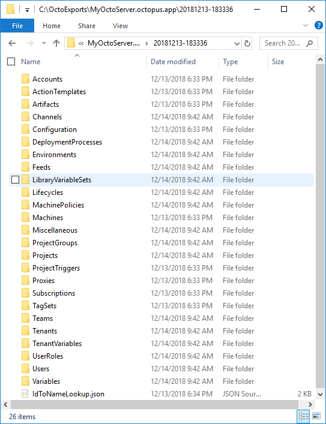

# What Does an Export Look Like Anyway?

## Export Folder Structure

An export is stored in a date-time stamp folder name.  Here's an example of the contents:



Each folder contains all the exported contents of a particular REST API call; items exported from Accounts API (/api/accounts) are in the Accounts folder, etc.  One exception to that is the Miscellaneous folder which contains the output of all 'Simple' REST API requests; see [type descriptions](TypeDescription.md) for more information.

All exported content is stored in JSON files.  So, what does a particular JSON look like?

## Sample Export File - Environment

```JSON
{
  "Id": "Environments-8",
  "Name": "Staging",
  "Description": "Staging environment",
  "SortOrder": 1,
  "UseGuidedFailure": false,
  "AllowDynamicInfrastructure": false,
  "Links": {
    "Self": "/api/environments/Environments-8",
    "Machines": "/api/environments/Environments-8/machines{?skip,take,partialName,roles,isDisabled,healthStatuses,commStyles,tenantIds,tenantTags}",
    "SinglyScopedVariableDetails": "/api/environments/Environments-8/singlyScopedVariableDetails"
  },
  "MachineIds": [
    "Machines-44",
    "Machines-38",
    "Machines-62",
    "Machines-20",
    "Machines-11",
    "Machines-81",
    "Machines-31",
    "Machines-32",
    "Machines-20",
    "Machines-16"
  ],
  "MachineNames": [
    "STGAUTH01",
    "STGAUTH02",
    "STGMAP01",
    "STGMAP02",
    "STGMAP03",
    "STGMAP04",
    "STGSERV01",
    "STGSERV02",
    "STGWEB01",
    "STGWEB02"
  ]
}
```

If you are familiar with the Environments API call, or you checked out the [Swagger docs](https://demo.octopus.com/swaggerui/index.html), you might notice something peculiar.  The MachineIds and MachineNames *are not* a part of the actual data returned by the Environments API call.  What gives?

This is the magic of the [post-processing](PostProcessing.md) step - it makes the exported data **much** more useful for you.  In the case of Environment data, the post-processing goes and looks through all the Machines, finds ones that list the particular Environment in the machine's EnvironmentIds field and then grabs that machine id **and its name** and adds that info to the Environment JSON.  This is super handy!  Do you want to search through every machine just to find out which machines are in a particular environment?  Of course not - so ODU does it for you!

This post-processing does a lot of magic!  If you are wondering what info gets added to a JSON file during post-processing you can usually find the fields that appear after the first Links instance in the file.  Again, you can learn more about [post-processing](PostProcessing.md).

Now, let's look at a much more complex example.

## Sample Export File - Project

Below is a project JSON file that has been post-processed.  It's big - *and it's been edited* - so let me summarize the types of changes you can see.

1. By default a project export from Octopus is pretty simple, it contains only a fraction of this info.  The post-processing looks up and 'joins' all of the external data so it's much more helpful for reporting and processing.
2. Fields with suffix a field 'Id' *and* that have a proper user-friendly name are looked up and added to it.  For example "IncludedLibraryVariableSetIds" = "LibraryVariableSets-7" comes with the export but post-processing has added "IncludedLibraryVariableSetNames" = "Global Variables 1". The same is true for ClonedFromProjectName, LifecycleName and ProjectGroupName.
3. By default the project only contains a reference to the deploy process; post-processing adds the applicable DeploymentProcess section to it.
4. Same is true for both the native project variables (VariableSet) and all IncludedLibraryVariableSets

```JSON
{
  "Id": "Projects-4",
  "VariableSetId": "variableset-Projects-4",
  "DeploymentProcessId": "deploymentprocess-Projects-4",
  "ClonedFromProjectId": null,
  "DiscreteChannelRelease": false,
  "IncludedLibraryVariableSetIds": [
    "LibraryVariableSets-7"
  ],
  "DefaultToSkipIfAlreadyInstalled": false,
  "TenantedDeploymentMode": "Untenanted",
  "DefaultGuidedFailureMode": "EnvironmentDefault",
  "VersioningStrategy": {
    "DonorPackageStepId": "d4c0602f-d761-4d75-8cb7-bebe2978d650",
    "Template": null
  },
  "ReleaseCreationStrategy": {
    "ReleaseCreationPackageStepId": "",
    "ChannelId": null
  },
  "Templates": [],
  "AutoDeployReleaseOverrides": [],
  "Name": "MyCo.WebMain",
  "Slug": "myco.webmain",
  "Description": "Primary front-end web application",
  "IsDisabled": false,
  "ProjectGroupId": "ProjectGroups-9",
  "LifecycleId": "Lifecycles-6",
  "AutoCreateRelease": false,
  "ProjectConnectivityPolicy": {
    "SkipMachineBehavior": "None",
    "TargetRoles": [],
    "AllowDeploymentsToNoTargets": false
  },
  "ClonedFromProjectName": null,
  "IncludedLibraryVariableSetNames": [
    "Global Variables 1"
  ],
  "LifecycleName": "MyCo Lifecycle",
  "ProjectGroupName": "MyCo",
  "DeploymentProcess": {
    "Id": "deploymentprocess-Projects-4",
    "ProjectId": "Projects-4",
    "Steps": [
      {
        "Id": "cbe26ac9-18ee-4db8-9e20-aa48aa813abf",
        "Name": "Deploy to IIS",
        "PackageRequirement": "LetOctopusDecide",
        "Properties": {
          "Octopus.Action.TargetRoles": "WEB"
        },
        "Condition": "Always",
        "StartTrigger": "StartAfterPrevious",
        "Actions": [
          {
            "Id": "d4c0602f-d761-4d75-8cb7-bebe2978d650",
            "Name": "Deploy to IIS",
            "ActionType": "Octopus.IIS",
            "IsDisabled": false,
            "CanBeUsedForProjectVersioning": true,
            "IsRequired": false,
            "WorkerPoolId": null,
            "Environments": [],
            "ExcludedEnvironments": [],
            "Channels": [],
            "TenantTags": [],
            "Packages": [
              {
                "Name": "",
                "PackageId": "MyCo.WebMain",
                "FeedId": "feeds-builtin",
                "AcquisitionLocation": "Server",
                "Properties": {}
              }
            ],
            "Properties": {
              "Octopus.Action.IISWebSite.DeploymentType": "webSite",
              "Octopus.Action.IISWebSite.CreateOrUpdateWebSite": "True",
              "Octopus.Action.IISWebSite.Bindings": "[{\"protocol\":\"https\",\"ipAddress\":\"#{IpAddress}\",\"port\":\"#{BindingPortNumber}\",\"host\":\"#{HostName}\",\"thumbprint\":\"#{SSLBindingCertificateThumbprint}\",\"certificateVariable\":null,\"requireSni\":false,\"enabled\":true}]",
              "Octopus.Action.IISWebSite.ApplicationPoolFrameworkVersion": "v4.0",
              "Octopus.Action.IISWebSite.ApplicationPoolIdentityType": "NetworkService",
              "Octopus.Action.IISWebSite.EnableAnonymousAuthentication": "True",
              "Octopus.Action.IISWebSite.EnableBasicAuthentication": "False",
              "Octopus.Action.IISWebSite.EnableWindowsAuthentication": "False",
              "Octopus.Action.IISWebSite.WebApplication.ApplicationPoolFrameworkVersion": "v4.0",
              "Octopus.Action.IISWebSite.WebApplication.ApplicationPoolIdentityType": "ApplicationPoolIdentity",
              "Octopus.Action.Package.AutomaticallyRunConfigurationTransformationFiles": "True",
              "Octopus.Action.Package.AutomaticallyUpdateAppSettingsAndConnectionStrings": "True",
              "Octopus.Action.EnabledFeatures": "Octopus.Features.IISWebSite,Octopus.Features.CustomDirectory,Octopus.Features.ConfigurationVariables,Octopus.Features.ConfigurationTransforms,Octopus.Features.SubstituteInFiles",
              "Octopus.Action.Package.FeedId": "feeds-builtin",
              "Octopus.Action.Package.DownloadOnTentacle": "False",
              "Octopus.Action.IISWebSite.StartApplicationPool": "True",
              "Octopus.Action.Package.PackageId": "MyCo.WebMain",
              "Octopus.Action.IISWebSite.WebSiteName": "#{SiteName}",
              "Octopus.Action.IISWebSite.WebRootType": "packageRoot",
              "Octopus.Action.IISWebSite.ApplicationPoolName": "#{SiteName}",
              "Octopus.Action.Package.CustomInstallationDirectory": "#{ApplicationPath}\\MyCo.WebMain",
              "Octopus.Action.Package.AdditionalXmlConfigurationTransforms": "*.Release.xml => *.xml",
              "Octopus.Action.SubstituteInFiles.Enabled": "True",
              "Octopus.Action.SubstituteInFiles.TargetFiles": "*.config",
              "Octopus.Action.IISWebSite.StartWebSite": "True",
              "Octopus.Action.Package.CustomInstallationDirectoryShouldBePurgedBeforeDeployment": "True"
            },
            "Links": {}
          }
        ]
      }
    ],
    "Version": 22,
    "LastSnapshotId": null,
    "Links": {
      "Self": "/api/deploymentprocesses/deploymentprocess-Projects-4",
      "Project": "/api/projects/Projects-4",
      "Template": "/api/deploymentprocesses/deploymentprocess-Projects-4/template{?channel,releaseId}"
    },
    "LastSnapshotName": null,
    "ProjectName": "MyCo.WebMain"
  },
  "VariableSet": {
    "Id": "variableset-Projects-4",
    "OwnerId": "Projects-4",
    "Version": 5,
    "Variables": [
      {
        "Id": "ad1227ba-525b-4ff7-db9c-f688d0543cda",
        "Name": "Hostname",
        "Value": "",
        "Description": null,
        "Scope": {},
        "IsEditable": true,
        "Prompt": null,
        "Type": "String",
        "IsSensitive": false
      },
      {
        "Id": "54655063-a823-fa09-7801-767a2b212bda",
        "Name": "SiteName",
        "Value": "MyCo-Main",
        "Description": null,
        "Scope": {
          "Environment": [
            "Environments-8"
          ],
          "EnvironmentName": [
            "Staging"
          ],
          "Breadth": [
            "Staging"
          ]
        },
        "IsEditable": true,
        "Prompt": null,
        "Type": "String",
        "IsSensitive": false
      },
      ...removed for brevity...
    ],

    "ScopeValues": {
      ...removed for brevity...
    },
    "Links": {
      "Self": "/api/variables/variableset-Projects-4"
    },
    "OwnerName": "MyCo.WebMain"
  },
  "IncludedLibraryVariableSets": [
    {
      "Id": "LibraryVariableSets-7",
      "Name": "Global Variables 1",
      "Description": "Default global variables for MyCo",
      "VariableSetId": "variableset-LibraryVariableSets-7",
      "ContentType": "Variables",
      "Templates": [],
      "Links": {
        "Self": "/api/libraryvariablesets/LibraryVariableSets-7",
        "Variables": "/api/variables/variableset-LibraryVariableSets-7"
      },
      "VariableSet": {
        "Id": "variableset-LibraryVariableSets-7",
        "OwnerId": "LibraryVariableSets-7",
        "Version": 12,
        "Variables": [
          {
            "Id": "f4f385c4-d588-43f0-b816-4206187f5744",
            "Name": "Connect1Password",
            "Value": null,
            "Description": "",
            "Scope": {
              "Environment": [
                "Environments-23", "Environments-27"
              ],
              "EnvironmentName": [
                "WebDev-4", "WebDev-9"
              ],
              "Breadth": [
                "WebDev-4", "WebDev-9"
              ]
            },
            "IsEditable": true,
            "Prompt": null,
            "Type": "Sensitive",
            "IsSensitive": true
          },
          ...removed for brevity...
        ],
        "ScopeValues": {
          ...removed for brevity...
        },
        "Links": {
          "Self": "/api/variables/variableset-LibraryVariableSets-7"
        },
        "OwnerName": "Global Variables 1"
      }
    }
  ]
}
```

