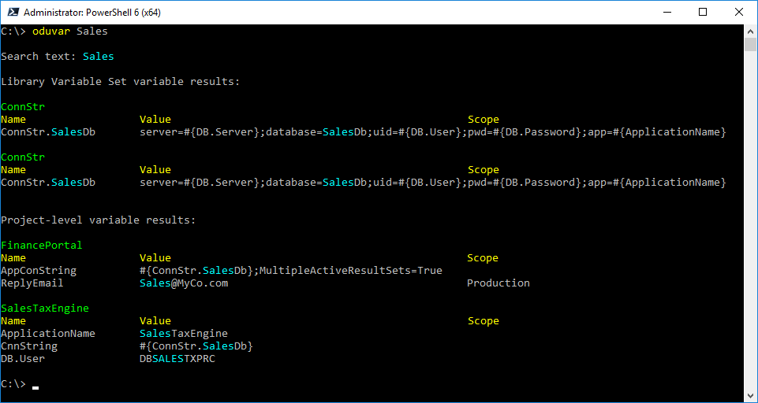
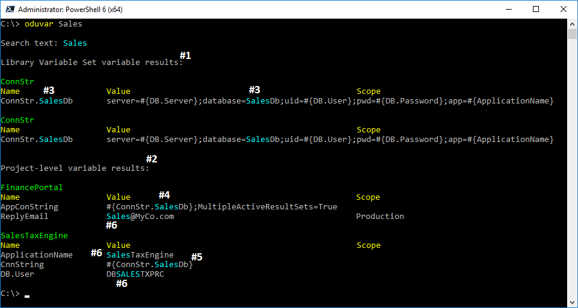
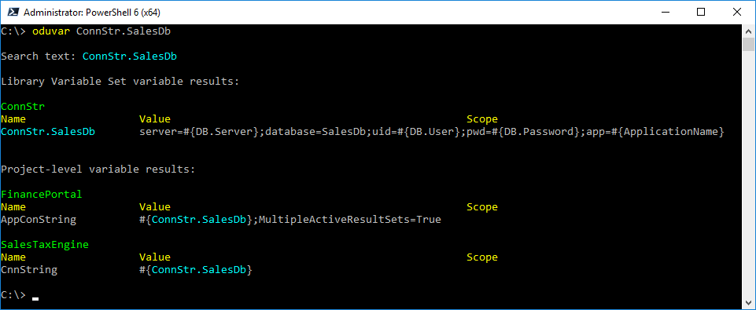
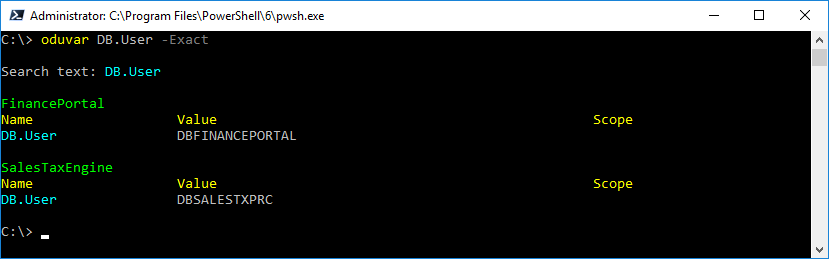
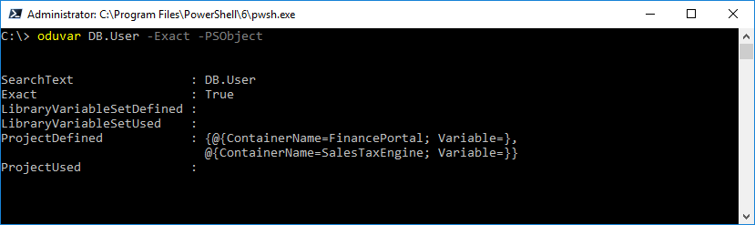
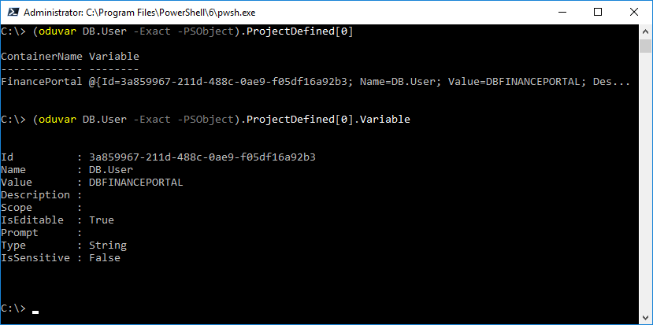

# Search for Variables By Name or Value

Once your start to have a lot of projects - with a lot of variables and a lot of included library variable sets each with their *own* variables - searching for variables can be a pain in the Octopus Deploy web site.  It has some filtering capabilities based on name, value, etc. but these only work within a particular variable listing (project or included library variable set).  And while you can open an export in a text editor and search for variables that way, that can be a bit tedious.  Fortunately Octopus Deploy Utilities comes with a handy tool: oduvar.

## oduvar to the Rescue!

oduvar, an alias of Find-ODUVariable, will search all variables (project-level and included library variable set-level) at once for text that matches in either the variable name or the variable's value - or both!  And it can be a partial match or an exact match.

Quick example: let's say you have a bunch of projects and you want to see which ones might be accessing the sales database.  You aren't sure of any of the variable names or if included library variable sets are used but let's just try a quick search for `sales` - you know that sales database connection string is in there somewhere.



Woah, there's a lot going on here, let's break it down:




1. First displayed are search results found in library sets.  Also the results appear repeated - why is that?  Explanation for that later.

2. Second displayed are search results found in projects.

3. In the library variable sets we can see `sales` was matched in both the variable name and the value.  That value appears to be the connection string we are looking for; the database name is indicated in the `database=SalesDb` portion.  And the name for that particular variable is `ConnStr.SaleDb` - good to know.

4. In the FinancePortal project, there appears to be a project-level variable `AppConString` (meaning the local application config file has a variable named AppConString) and the value of that variable is ConnStr.SaleDb *plus* `MultipleActiveResultSets=True`.  That's very handy to know - it's using the connection string value but modifying it.

5. In the SalesTaxEngine project, there's a project-level variable `CnnString` that appears to be using ConnStr.SaleDb as-is.  Good to know.

6. There are more matches the value `sales` was found in values of variables ReplyEmail, ApplicationName and DB.User.  We aren't worried about these right now.

Now that we know what we are looking for, we could do a more explicit search:




## Exact Matches

As mentioned earlier, oduvar can also perform exact matches.  This will *only* return results where the entire variable name and / or value matches the search text completely (case-insensitive).



## What's With All the Colors???

oduvar is designed to be a simple, fast search tool for finding variables based on name and / or value.  It's assumed once you've done a basic search you might do a refined search in oduvar, or search more in a text editor... but most likely you'll go straight to the Octopus Deploy server web site.  To that end, *by default* oduvar outputs it's results with color, highlighting where the match occurs.  This is especially helpful if you combine an existing variable value in a new variable value using the `#{VariableName}` notation - like with the FinancePortal variable AppConString.

To output color, oduvar uses Write-Host.  One side effect of this is that it becomes a little harder (*but not impossible*) to capture all its output in a variable or to file.  But don't worry, if you want to capture it all easily you can specify the switch `-WriteOutput` and you can capture your search results:

```PowerShell
C:\> oduvar Sales -WriteOutput > c:\temp\SalesSearchResults.txt
```


## But I Want Objects!

OK! OK!  In the PowerShell world we are using to getting back objects from our cmdlet and function calls.  Again, the *default* purpose of oduvar is to provide quick, **visual** search results... but you can also get objects by specifying the `-PSObject` switch:



These results may not be exactly what you were expecting because they don't match the visual in the default search result.  That's by design; these results are actually more structured than what you see in the visual output.  They are structured like this so that you can use these results in your own meta or command-line searching.  The fields are:

|Property|Description|
|---|---|
|SearchText|Text searched for|
|Exact|Exact match? true or false|
|LibraryVariableSetDefined|Variable matches by NAME for included library variable sets|
|LibraryVariableSetUsed|Variable matches by VALUE for included library variable sets|
|ProjectDefined|Variable matches by NAME for project-level variables|
|ProjectUsed|Variable matches by VALUE for project-level variables|

This structured design is also why library variable set ConnStr was repeated in the original screenshot: `Sales` appears as a match in both the variable name and the variable value so separate entries appeared in both LibraryVariableSetDefined and LibraryVariableSetUsed.  (This might not be 100% apparent as whenever the line is output, no matter which source, oduvar highlights the text in both the name and value).


To wrap up this discussion, let's take a closer look at the search results object, specifically the FinancePortal project:

