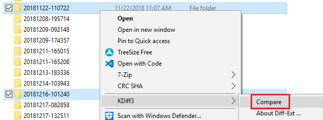

# Viewing Changes Over Time

The built-in Octopus Deploy Audit feature is handy for seeing the history of specific changes - and who made them - to a single item.  However it's not great if you have a lot of items (projects, deploy processes, machines, included variables sets, etc.) and a lot of history.  Sometimes you need to find a change ("this was working last week!") and you don't know where it is (the project base settings? the project deploy process? the project variables? a variableset included with the project? the machine? the environment? some combination???) *and* you are in a bit of a rush ("PRODUCTION IS DOWN!").  We've all been there.

In this case the Audit tool is not going to work.

## Export Often and Diff!

If you've had this problem, or you just want an easier way to see all the changes to your system over time, there's an easy solution: export your Octopus Deploy configuration often and diff the exports!  [Schedule a export](SetupUsage.md#schedule-exports) to run every so often (once a day or week, once every few hours...?) and use your diff tool of choice to compare the export folders.



How easy is that?  In *seconds* you can open up a diff to show you all the changes to your Octopus Deploy configuration over time.

## Built-in Shortcut: odudiff

If you configured the path to your diff viewer with `Set-ODUConfigDiffViewer` there's a handy shortcut for you: `odudiff`.  If you run it with no parameters it opens up your diff viewer comparing the two most recent exports.  However, if you supply a parameter to it (hours) it opens your diff viewer comparing the most recent export with the first export that is at least that many hours older than the latest export.

```PowerShell
C:\> # opens your diff viewer comparing the two most recent exports (most recent on right-side, of course)
C:\> odudiff
C:\> 
C:\> # opens diff of most recent export and first export that is 48 hours older than the most recent export
C:\> odudiff 48
C:\> 
C:\> # opens diff of most recent export and first export that is 3 weeks older than the most recent export
C:\> odudiff (24 * 7 * 3)
C:\> # nice!
```

If you have spent a lot of time reviewing Octopus Deploy configuration changes over time (as I have) this shortcut becomes super-handy!
